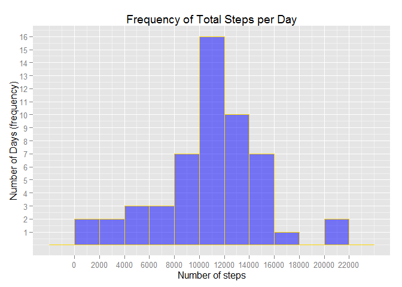
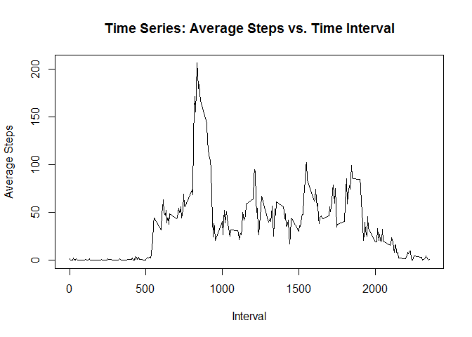
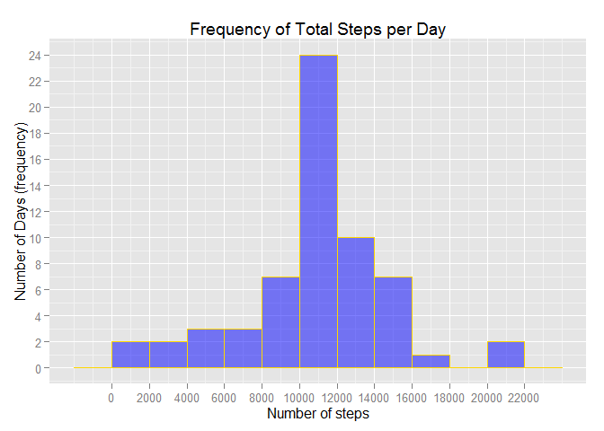
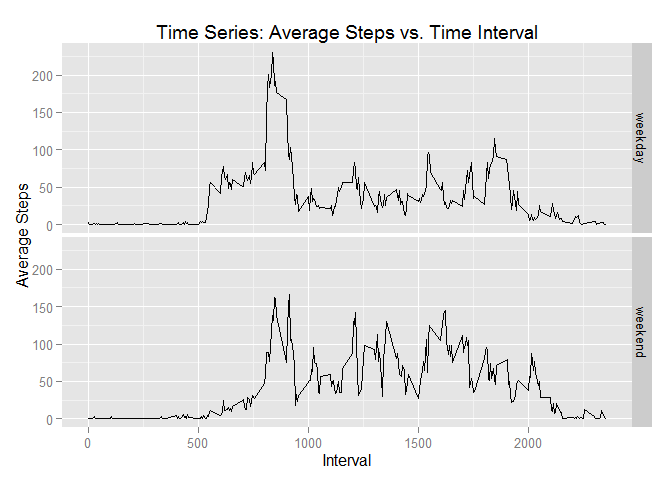

# Reproducible Research: Peer Assessment 1


## Loading and preprocessing (if necessary) the data 

```r
data <- read.csv("activity.csv")
```

## What is mean total number of steps taken per day?

#### 1. Calculate the total number of steps taken per day

```r
# load necessary packages & convert data into a tbl for dplyr
library(dplyr)
library(ggplot2)
data <- tbl_df(data)

# group the data, by day
byday <- group_by(data, date)

# calculate total number of steps taken by day, ignore missing values here
# note: dates where steps is NA for all observations will not be included
byday <- filter(byday, !is.na(steps))
byday <- summarize(byday, totalSteps = sum(steps,na.rm=TRUE))
```

#### 2. construct histogram of the total number of steps taken each day

```r
qplot(byday$totalSteps, geom = "histogram",binwidth=2000, 
      main = "Frequency of Total Steps per Day", xlab = "Number of steps", 
      ylab = "Number of Days (frequency)", fill = I("blue"), col = I("gold"),
      alpha=I(.5)) +
    scale_x_continuous(breaks=seq(0,22000,by=2000))+
    scale_y_continuous(breaks=1:16)
```

 

#### 3. mean & median of the total number of steps taken per day

```r
mean(byday$totalSteps)
```

```
## [1] 10766.19
```

```r
median(byday$totalSteps)
```

```
## [1] 10765
```


## What is the average daily activity pattern?

#### 1. Make a time series plot of the 5-minute interval (x-axis) and the average number of steps taken, averaged across all days (y-axis)


```r
data <- tbl_df(data)

# group the data, by time interval
byinterval <- group_by(data, interval)

# calculate average number of steps across all days, by interval 
# note: dates where steps is NA for all observations will not be included
byinterval <- filter(byinterval, !is.na(steps))
byinterval <- summarize(byinterval, avgSteps = mean(steps,na.rm=TRUE))

# construct desired time series plot
plot(byinterval$interval,byinterval$avgSteps,type="l", xlab="Interval",
     main="Time Series: Average Steps vs. Time Interval",ylab="Average Steps")
```

 

#### 2. Which 5-minute interval, on average across all the days in the dataset, contains the maximum number of steps?


```r
maxindex <- which(byinterval$avgSteps == max(byinterval$avgSteps))
as.numeric(byinterval[maxindex,1])
```

```
## [1] 835
```


## Imputing missing values

#### 1. Calculate and report the total number of missing values in the dataset


```r
missings <- which(is.na(data$steps))
length(missings)
```

```
## [1] 2304
```

#### 2 & 3. Devise a strategy for filling in all of the missing values in the dataset, then actually fill them in. My strategy is to use the mean of each 5-minute interval. 


```r
data <- tbl_df(data)

# group the data, by time interval
byint2 <- group_by(data, interval)

# get mean number of steps for each interval, excluding missing values
meansByInt <- summarize(byint2,avg=mean(steps,na.rm=TRUE))

# impute these averages for all missing values, by interval
for(i in missings){
missingint <- as.numeric(byint2[i,3]) # time interval for missing observation
intIndex <- which(meansByInt$interval == missingint)
byint2$steps[i] = meansByInt[intIndex,2] #impute NA's
}

byint3 <- as.data.frame(byint2)
```

#### 4. Make a histogram of the total number of steps taken each day and Calculate and report the mean and median total number of steps taken per day

```r
# group the data, by day
byday <- tbl_df(byint3)
byday <- group_by(byday, date)
byday <- summarize(byday, totalSteps = sum(as.numeric(steps)))

qplot(byday$totalSteps, geom = "histogram",binwidth=2000, 
      main = "Frequency of Total Steps per Day", xlab = "Number of steps", 
      ylab = "Number of Days (frequency)", fill = I("blue"), col = I("gold"),
      alpha=I(.5)) +
    scale_x_continuous(breaks=seq(0,22000,by=2000))+
    scale_y_continuous(breaks=seq(0,24,by=2))
```

 

```r
mean(byday$totalSteps)
```

```
## [1] 10766.19
```

```r
median(byday$totalSteps)
```

```
## [1] 10766.19
```
As we can see from the output, only the *median* value differers from the estimates from the first part of the assignment. However, this difference is of very small magnitude. Thus, the impact of the strategy I used for imputing missing data on the estimates of the total daily number of steps was **minimal**

## Are there differences in activity patterns between weekdays and weekends?

#### 1. Create a new factor variable in the dataset with two levels – “weekday” and “weekend” indicating whether a given date is a weekday or weekend day.


```r
# convert dates to class Date.
byint3$date <- as.character(byint3$date)
byint3$date <- as.Date(byint3$date, "%Y-%m-%d")

# use weekdays() to determine what day of the week it is for all dates
byint3$weekdays <- weekdays(byint3$date,FALSE)
byint3$weekdays <- gsub("Monday","weekday",byint3$weekday,ignore.case=TRUE)
byint3$weekdays <- gsub("Tuesday","weekday",byint3$weekday,ignore.case=TRUE)
byint3$weekdays <-gsub("Wednesday","weekday",byint3$weekday,ignore.case=TRUE)
byint3$weekdays <- gsub("Thursday","weekday",byint3$weekday,ignore.case=TRUE)
byint3$weekdays <- gsub("Friday","weekday",byint3$weekday,ignore.case=TRUE)
byint3$weekdays <-gsub("Saturday","weekend",byint3$weekday,ignore.case=TRUE)
byint3$weekdays <-gsub("Sunday","weekend",byint3$weekday,ignore.case=TRUE)
byint3$weekdays <- factor(byint3$weekdays)
```

#### 2. Make a panel plot containing a time series plot (i.e. type = "l") of the 5-minute interval (x-axis) and the average number of steps taken, averaged across all weekday days or weekend days (y-axis)


```r
# group the data, by time interval
byinterval <- group_by(tbl_df(byint3), interval, weekdays)
byinterval$steps <- unlist(byinterval$steps) # convert steps var to numeric

# calculate average number of steps across all days, by interval 
byinterval <- summarize(byinterval, avgSteps = mean(steps))

# construct desired time series plot
ggplot(byinterval, aes(x = interval, y = avgSteps)) +
           geom_line(aes(group=1)) + facet_grid(weekdays ~ .)+
           labs(x="Interval",y="Average Steps") + 
           labs(title="Time Series: Average Steps vs. Time Interval")    
```

 
